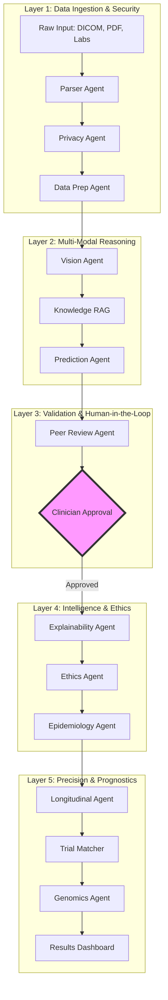
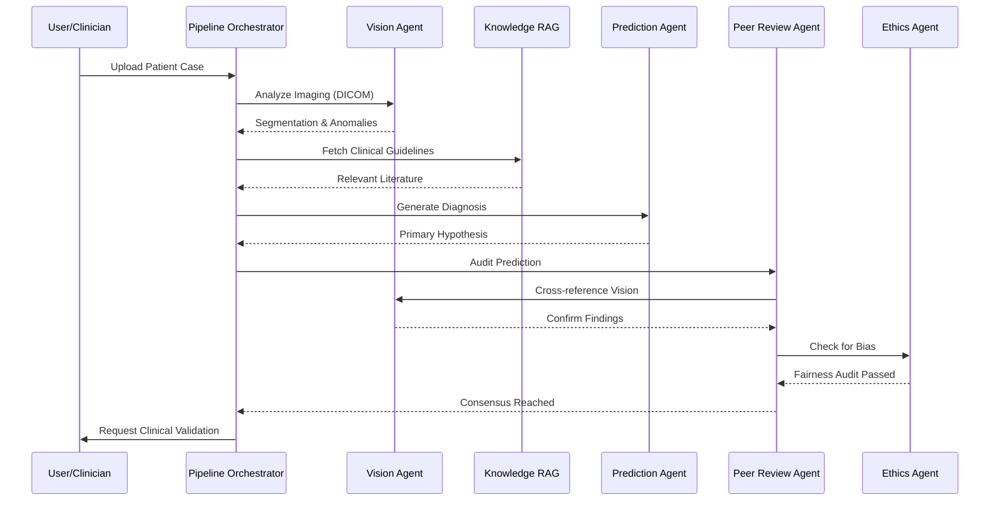
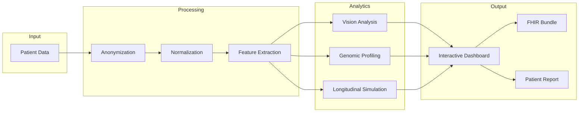

# Medical AI Agents Pipeline (14-Agent Precision Edition)

A world-class, multi-modal medical intelligence platform powered by 14 specialized AI agents, designed for clinical excellence, precision medicine, and ethical accountability.

## 🚀 Overview

The Medical AI Agents Pipeline is a sophisticated diagnostic and prognostic platform that orchestrates 14 specialized AI agents to process complex patient data. By integrating medical imaging (DICOM), laboratory results, patient history, and genomic data, the system provides clinicians with high-confidence diagnostic predictions, longitudinal health trajectories, and personalized treatment recommendations.

## 🏗 System Architecture

The system is organized into five distinct layers, ensuring separation of concerns and a robust clinical workflow.



## 🤝 Multi-Agent Collaboration

This diagram illustrates how agents collaborate in real-time to reach a diagnostic consensus.



## 📊 Data Flow & Analytics Pipeline

The flow of data from raw input to actionable clinical insights.



## 🧠 The 14-Agent Ecosystem

### 1. Data Ingestion & Privacy Layer
- **Agent 1: Medical Document Parser**: Extracts structured data from MRI reports, lab PDFs, and notes.
- **Agent 2: Privacy Protection Agent**: Ensures HIPAA/GDPR compliance via PII scrubbing.
- **Agent 3: Data Preparation Agent**: Normalizes terminology (SNOMED CT, LOINC).

### 2. Multi-Modal Analysis Layer
- **Agent 4: Medical Vision Agent**: Analyzes imaging (X-Rays, CT, MRI) for anomalies.
- **Agent 5: Medical Knowledge RAG**: Retrieves clinical guidelines from PubMed/institutional DBs.
- **Agent 6: Diagnostic Prediction Agent**: Synthesizes vision and text for primary hypotheses.

### 3. Validation & Ethics Layer
- **Agent 7: Peer Review Agent**: "Second opinion" AI for error and bias detection.
- **Agent 8: Ethics & Compliance Agent**: Monitors pipeline for fairness and regulatory adherence.
- **Agent 9: Explainability Agent**: Generates reasoning chains and interactive citations.

### 4. Precision & Prognostics Layer
- **Agent 10: Patient Advocate Agent**: Translates clinical findings into empathetic summaries.
- **Agent 11: Epidemiological Agent**: Contextualizes cases within global health trends.
- **Agent 12: Longitudinal Tracking Agent**: Predicts health trajectories over 12 months.
- **Agent 13: Clinical Trial Matcher**: Matches patients with active clinical studies.
- **Agent 14: Pharmacogenomics Agent**: Predicts drug efficacy based on genetic variants.

## ✨ Key Features

- **🔬 Multi-Modal Diagnostics**: Interactive heatmaps and bounding boxes on DICOM images.
- **🧬 Precision Medicine**: Genetic-based medication optimization (e.g., CYP2C9 analysis).
- **⚖️ Ethical Guardrails**: Real-time fairness auditing and bias mitigation transparency.
- **🌐 Interoperability**: FHIR-compatible JSON bundle export for EHR integration.
- **📊 Advanced Visualizations**: 12-month trajectory charts and population analytics.

## 🎨 Design System

- **Typography**: Outfit (Headings), Inter (Body).
- **Aesthetics**: Mesh gradients, glassmorphism, and agent-specific color coding.
- **Interactions**: Framer Motion animations and 3D-like hover effects.

## 🚦 Getting Started

```bash
npm install
npm run dev
npm run build
```

---
*Disclaimer: This is a simulated medical intelligence platform for demonstration purposes.*
